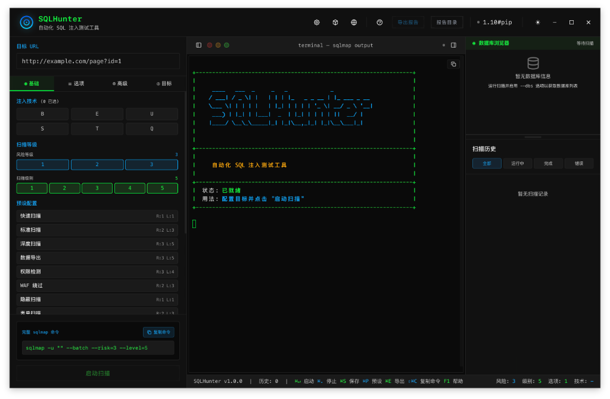
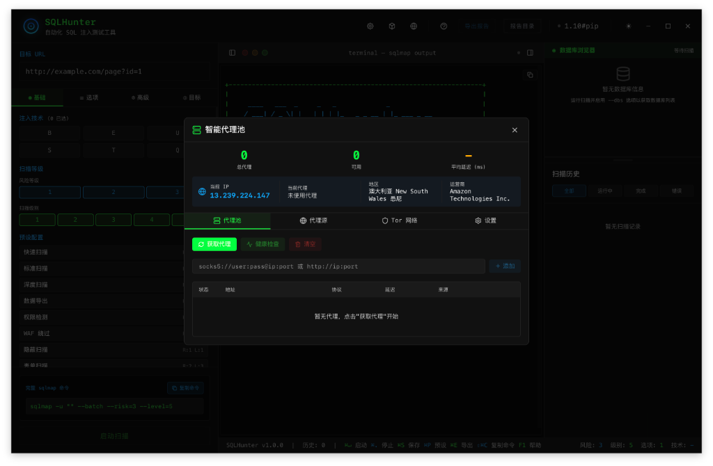

# SQLHunter

<p align="center">
  
</p>

<p align="center">
  <b>A Modern SQL Injection Detection & Exploitation Tool</b>
</p>

<p align="center">
  <a href="#features">Features</a> •
  <a href="#installation">Installation</a> •
  <a href="#quick-start">Quick Start</a> •
  <a href="https://robot0p.github.io/SQLHunter/guide-en.html">Documentation</a>
</p>

<p align="center">
  <a href="README.md">中文</a> | English
</p>

---

<p align="center">
  
</p>

---

## Features

### Smart Scanning
- **One-Click Scan**: Enter target URL, automatically detect SQL injection vulnerabilities
- **Batch Scanning**: Import multiple targets for batch testing
- **Task Queue**: Auto-manage scan tasks with concurrency control
- **Real-time Output**: View live scan logs and progress

### Advanced Configuration
- **Visual Config Panel**: Configure all sqlmap parameters through intuitive interface
- **Preset Management**: Save common configurations as presets
- **Target Manager**: Manage multiple targets with groups and tags
- **Payload Manager**: Customize and manage injection payloads

### Proxy Support
- **Smart Proxy Pool**: Auto-fetch and manage proxies with rotation
- **Proxy Health Check**: Periodically verify proxy availability
- **Tor Integration**: One-click Tor with identity switching
- **Circuit Visualization**: Real-time display of Tor circuit nodes

<p align="center">
  
  <br>
  <em>Smart Proxy Pool - Proxy Management & Tor Integration</em>
</p>

### Result Analysis
- **AI Analysis**: Smart analysis of scan results with vulnerability assessment
- **Database Tree**: Visual display of extracted database structure
- **Report Export**: Export scan reports

### User Experience
- **Multi-Theme**: 8 beautiful themes including Cyberpunk, Matrix, Neon
- **Bilingual**: Full Chinese and English interface support
- **Cross-Platform**: Windows, macOS, Linux

---

## Installation

### System Requirements
- **OS**: Windows 10+, macOS 10.13+, Linux (Ubuntu 18.04+)
- **Dependencies**: Python 3.x, sqlmap

### Download

Download the installer for your platform from [Releases](https://github.com/Robot0P/SQLHunter/releases):

| Platform | File |
|----------|------|
| Windows | `SQLHunter_x.x.x_x64-setup.exe` |
| macOS | `SQLHunter_x.x.x_x64.dmg` |
| Linux | `SQLHunter_x.x.x_amd64.deb` |

### Environment Check

On first launch, the app will auto-detect dependencies:
- Installed dependencies show green checkmark
- Missing dependencies can be auto-fixed with one click

---

## Quick Start

### 1. Basic Scan

1. Enter target URL with injection parameter in the input field:
   ```
   http://example.com/page.php?id=1
   ```
2. Click "Start Scan" button
3. View real-time results in the Output panel

### 2. Using Proxy

1. Click the "Proxy Pool" icon in the top right
2. Add proxy sources in the "Sources" tab
3. Click "Fetch Proxies" to get proxy list
4. Enable "Smart Proxy Pool" toggle

### 3. Using Tor

1. Open "Proxy Pool" panel
2. Switch to "Tor" tab
3. Click "Start Tor" button
4. View Tor circuit nodes and exit IP

---

## Documentation

For detailed documentation, visit our [Documentation Page](https://robot0p.github.io/SQLHunter/guide-en.html).

### Configuration Panel

| Section | Function |
|---------|----------|
| Target Settings | URL, data, cookie, etc. |
| Detection Options | Detection level, risk level |
| Injection Techniques | Select injection technique types |
| Enumeration Options | Database, table, column enumeration |
| Advanced Options | Proxy, threads, timeout, etc. |

### Keyboard Shortcuts

| Shortcut | Function |
|----------|----------|
| `Ctrl/Cmd + Enter` | Start Scan |
| `Ctrl/Cmd + .` | Stop Scan |
| `Ctrl/Cmd + ,` | Open Settings |
| `Ctrl/Cmd + L` | Clear Output |

---

## Themes

8 built-in themes:

- **Cyberpunk** - Neon pink/purple
- **Stealth** - Deep dark tones
- **Matrix** - Classic green terminal
- **Neon** - Vibrant purple
- **Light** - Bright and clean
- **Midnight** - Deep blue night sky
- **Dracula** - Classic dark
- **Monokai** - Code editor style

---

## FAQ

### Q: "sqlmap not installed" error?
A: Click "Environment Check" in settings, then "Auto Fix" to install sqlmap.

### Q: How to use Burp Suite requests?
A: Copy the request from Burp, paste into the "Request" section of config panel.

### Q: Tor won't start?
A: Make sure Tor is installed:
- macOS: `brew install tor`
- Linux: `sudo apt install tor`
- Windows: Download Tor Expert Bundle

### Q: How to add custom proxy sources?
A: In "Proxy Pool" → "Sources", add URLs that return `ip:port` format.

---

## Changelog

### v1.0.0 (2026-01-20)

**Initial Release**

- Smart scanning engine with multiple injection techniques
- Smart proxy pool with auto-fetch and rotation
- Tor network integration with one-click start
- Visual configuration panel with preset management
- AI-powered scan result analysis
- 8 beautiful themes
- Bilingual interface (Chinese/English)
- Cross-platform support (Windows, macOS, Linux)

---

## Disclaimer

This tool is for security research and authorized testing only. Unauthorized testing is illegal. Users bear full legal responsibility for their use of this tool.

---

<p align="center">
  <sub>Made with love for Security Researchers</sub>
</p>
